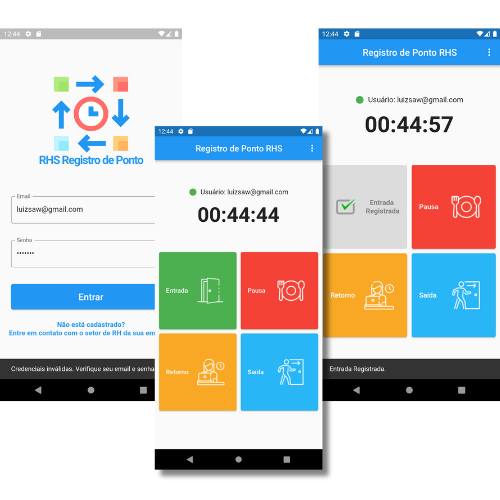

# 🌐 Portal do Funcionário

Bem-vindo ao **Portal do Funcionário**, uma aplicação web moderna desenvolvida com **React**, **JavaScript** e **CSS**, que oferece aos colaboradores uma plataforma simples e eficiente para gerenciar suas informações corporativas.

---

## 📌 Sobre o Projeto

O **Portal do Funcionário** é uma interface voltada para o colaborador, integrada a um sistema completo de **folha de pagamento**. Ele permite:

- 👤 Acesso seguro às **informações pessoais**
- 🧾 Visualização e **download de holerites**
- ⏱️ Consulta dos **registros de ponto**
- 📬 Acesso ao módulo de **mensagens internas**
- 👨‍💼 Área administrativa para controle e ajustes internos

---

## 🖼️ Capturas de Tela

<p align="center">
  
  
</p>

---

## 🛠️ Tecnologias Utilizadas

| Camada        | Tecnologias                                   |
|---------------|-----------------------------------------------|
| Frontend      | React, JavaScript (ES6+), HTML5, CSS3         |
| Backend       | Node.js (`server.js`)                         |
| Autenticação  | Firebase (via `FirebaseConnection.js`)        |

---

## 📁 Estrutura de Pastas

```
src/
├── Assets/                 # Imagens e recursos visuais
├── Components/             # Componentes reutilizáveis (ex: Header)
├── Pages/                  # Páginas principais (Home, Ponto, Admin etc.)
│   ├── Admin/
│   ├── Controle_Ponto/
│   ├── Folha_Pagamento/
│   ├── Home/
│   ├── Mensagens/
│   └── Register/
├── Routes/                 # Rotas e controle de acesso
├── App.js
├── index.js
```

---

## ⚙️ Como Executar Localmente

1. Clone o repositório:
   ```bash
   git clone https://github.com/seu-usuario/portal-do-funcionario.git
   cd portal-do-funcionario
   ```

2. Instale as dependências:
   ```bash
   npm install
   ```

3. Inicie a aplicação:
   ```bash
   npm start
   ```

> O projeto será executado em `http://localhost:3000`

---

## 🔐 Observações

- Este projeto utiliza autenticação via **Firebase**. Configure seu projeto no Firebase e substitua as credenciais em `FirebaseConnection.js` para funcionamento correto.
- O backend está presente em `server.js` e pode ser utilizado para futuras integrações com banco de dados ou APIs REST.

---

## ✨ Funcionalidades Futuras

- Dashboard com KPIs
- Upload de documentos pessoais
- Notificações em tempo real

---

## 🤝 Contribuições

Contribuições são sempre bem-vindas!  
Sinta-se à vontade para abrir uma *issue*, *forkar* o repositório e enviar um *pull request*.

